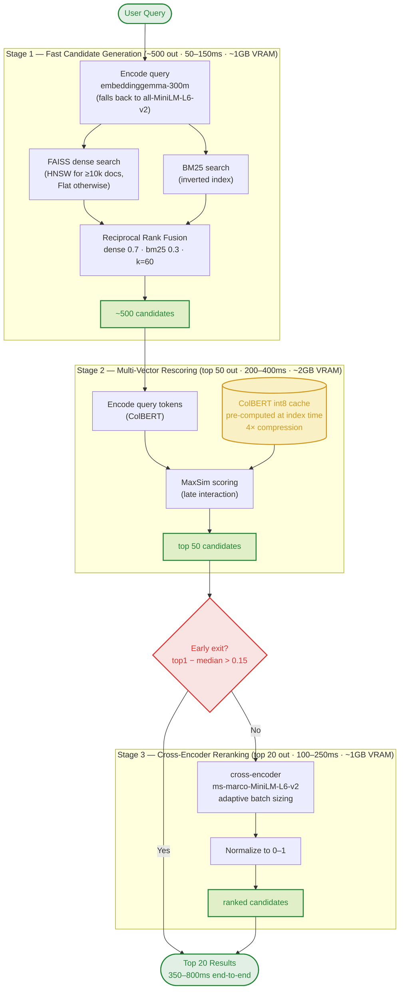
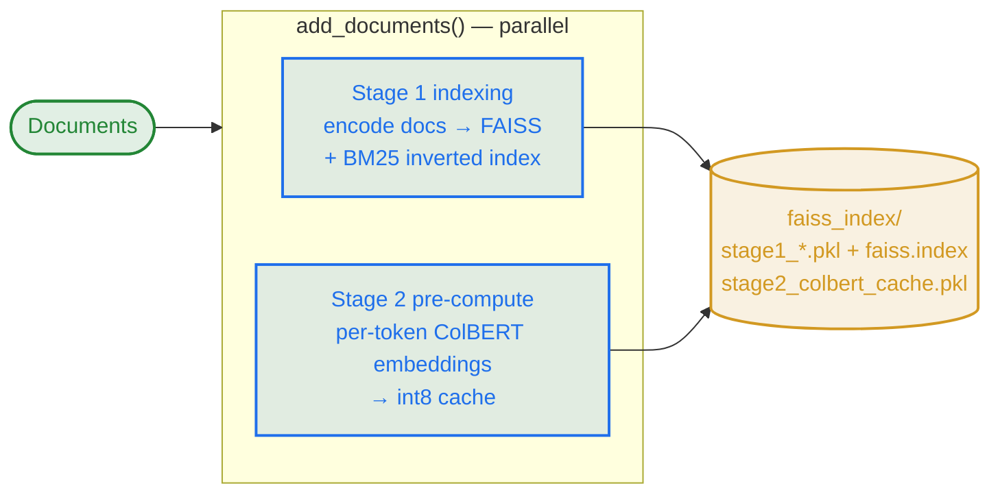

# TriStage-RAG

A theoretically-grounded **3-stage retrieval pipeline** for RAG systems, optimized for 4GB VRAM. Built on the findings of Weller et al. (2025), *"On the Theoretical Limitations of Embedding-Based Retrieval."*




---

## 🎯 Why three stages?

Single-vector embedding retrieval has a proven theoretical limit: with embedding dimension `d`, the number of distinct top-k result sets a model can return is bounded by `d`, regardless of training. On realistic, simple queries this limit is reachable. TriStage-RAG addresses it through **progressive refinement**, where each stage uses a representation with more expressive power than the last:

| Stage | Role | Model | Technique | Output |
|------|------|-------|-----------|--------|
| **1** | Fast candidate generation | `google/embeddinggemma-300m` (falls back to `all-MiniLM-L6-v2`) | FAISS dense + BM25, fused via **Reciprocal Rank Fusion** | ~500 candidates |
| **2** | Multi-vector rescoring | `lightonai/GTE-ModernColBERT-v1` | **ColBERT-style MaxSim** over an int8-quantized per-token embedding cache (pre-computed once at index time) | top 50 |
| **3** | Cross-encoder reranking | `cross-encoder/ms-marco-MiniLM-L6-v2` | Direct query-document co-attention, with **early-exit** and **adaptive batch sizing** | top 20 |

Expected latency on a 4GB-VRAM system: **350–800ms** end-to-end.

---

## 📦 Installation

Requires Python ≥ 3.9.

```bash
git clone <repository-url>
cd TriStage-RAG

# Install the package + the extras you want:
pip install -e ".[all]"      # everything (benchmark + web UI + dev)
# or pick:
#   pip install -e ".[benchmark]"  # MTEB / LIMIT evaluation
#   pip install -e ".[webui]"      # Flask UI + PDF/DOCX parsing
#   pip install -e ".[dev]"        # pytest only

cp .env.example .env          # add HUGGING_FACE_HUB_TOKEN if using gated models
```

| Extra | Adds |
|-------|------|
| `benchmark` | `mteb==2.0.0`, `datasets`, `scikit-learn`, `pandas` |
| `webui` | `Flask`, `pypdf`, `python-docx`, `sentencepiece` |
| `dev` | `pytest`, `pytest-asyncio` |
| `all` | all of the above |

> Without `[all]`, the core `RetrievalPipeline` still works — it only needs `sentence-transformers`, `torch`, `faiss-cpu`, `transformers`, and friends.

---

## 🚀 Quick start

### Programmatic (the public API)

```python
from tristage_rag import RetrievalPipeline, PipelineConfig

pipeline = RetrievalPipeline()                 # uses PipelineConfig defaults
pipeline.add_documents([
    "Python is a high-level programming language...",
    "Machine learning is a subset of artificial intelligence...",
    # ... up to a few thousand docs
])

result = pipeline.search("What is machine learning?", top_k=5)
for r in result["results"]:
    print(f"{r['stage3_score']:.4f}  {r['document'][:80]}")
```

The pipeline persists its FAISS index and ColBERT cache to `./faiss_index/`, so a restarted process can call `load_index()` and query immediately without re-encoding.

#### Indexing path (`add_documents`)

Stage 1 indexing and Stage 2 ColBERT pre-computation run **in parallel** (the expensive doc encoding happens once, at index time — not per query):



### Console scripts (after `pip install -e .[all]`)

| Command | What it does |
|---------|--------------|
| `tristage-benchmark` | One-click: download LIMIT dataset + models, run MTEB eval |
| `tristage-webui` | Launch the Flask web UI on `127.0.0.1:5051` |

### Plain scripts (no install needed)

```bash
python test_run.py                 # standalone smoke test of all 3 stages
python run_benchmark.py            # full MTEB benchmark workflow
python non_mcp/main.py             # standalone CLI app
python non_mcp/webui/app.py        # Flask web UI
```

---

## 🏗️ Project structure

```
TriStage-RAG/
├── tristage_rag/              # Core installable package
│   ├── __init__.py            #   public API: RetrievalPipeline, PipelineConfig, Stage*Config
│   ├── __version__.py
│   ├── retrieval_pipeline.py  #   orchestrator (parallel S1+S2 indexing, save/load, timing)
│   ├── stage1_retriever.py    #   FAISS + BM25 + RRF, custom inverted index, HNSW auto-switch
│   ├── stage2_rescorer.py     #   ColBERT MaxSim, int8-quantized per-token cache
│   ├── stage3_reranker.py     #   cross-encoder, early-exit, adaptive batching
│   ├── base_stage.py          #   shared device/GPU lifecycle
│   └── utils.py               #   resolve_model_path, get_device, clear_gpu_cache, BM25 tokenizer
├── benchmark/                 # MTEB evaluation suite (LIMIT dataset)
├── non_mcp/                   # Standalone apps: CLI, RAG generation, Flask web UI
├── tests/                     # pytest suite (fast unit + slow integration)
├── papers/                    # Reference research (ColBERT, ColBERTv2, GTR, SemEval-2026, theory)
├── research/                  # Design notes (ingestion pipeline)
├── docs/                      # Reports and improvement notes
├── pyproject.toml             # Packaging, optional extras, pytest config
├── run_benchmark.py           # One-click benchmark entry
├── test_run.py                # Standalone smoke test
└── test_benchmark.py          # Enterprise RAG sample benchmark
```

---

## ⚙️ Configuration

Two independent config files, one per surface:

| File | Used by | Notes |
|------|---------|-------|
| `benchmark/config.yaml` | `run_benchmark.py`, `tristage-benchmark` | MTEB evaluation, LIMIT dataset |
| `non_mcp/pipeline_config.yaml` | `non_mcp/main.py --config ...` | Standalone CLI/Web UI (CPU-oriented defaults) |

Both follow the same shape. For the programmatic API, construct a `PipelineConfig` directly — see its docstring for every field. Example:

```yaml
pipeline:
  device: "cuda"            # cuda | cpu | auto
  cache_dir: "./models"
  index_dir: "./faiss_index"

  stage1:
    model: "google/embeddinggemma-300m"
    top_k: 500
    enable_bm25: true
    fusion_method: "rrf"
    use_fp16: true

  stage2:
    model: "lightonai/GTE-ModernColBERT-v1"
    top_k: 100
    max_seq_length: 192
    use_fp16: true
    scoring_method: "maxsim"

  stage3:
    model: "cross-encoder/ms-marco-MiniLM-L6-v2"
    top_k: 20
    max_length: 256
    use_fp16: true
```

---

## 🧪 Testing

```bash
pytest                 # fast unit tests (BM25, utils, score normalization, adaptive batching)
pytest -m slow         # integration tests that download real models (needs network/GPU)
pytest tests/ -v       # everything, verbose
```

`@pytest.mark.slow` marks tests that require downloading the three real models. The `slow` marker is registered in `pyproject.toml`. See [`KNOWN_ISSUES.md`](KNOWN_ISSUES.md) for current coverage gaps.

---

## 📊 Benchmarking

```bash
tristage-benchmark              # or: python run_benchmark.py
```

Runs the [MTEB](https://github.com/embeddings-benchmark/mteb) retrieval evaluation against the [Google DeepMind LIMIT dataset](https://huggingface.co/datasets/google-deepmind/limit). Reports NDCG@10, Recall@10, MAP@10, MRR@10. Tune via `benchmark/config.yaml` (sample size, device, batch sizes, task selection). See [`benchmark/README.md`](benchmark/README.md).

---

## 🔧 Performance characteristics

| Component | Time | VRAM | Output |
|-----------|------|------|--------|
| Stage 1 | 50–150ms | ~1GB | 500 candidates |
| Stage 2 | 200–400ms | ~2GB | 50 candidates |
| Stage 3 | 100–250ms | ~1GB | 20 results |
| **Total** | **350–800ms** | **~4GB peak** | **20 results** |

- **VRAM**: 3–4GB peak (GPU recommended; CPU fallback automatic)
- **RAM**: 8–16GB depending on corpus size
- **Disk**: 2–5GB for the model cache

---

## 🤝 Contributing

See [`CONTRIBUTING.md`](CONTRIBUTING.md). Known limitations and deferred work are tracked in [`KNOWN_ISSUES.md`](KNOWN_ISSUES.md).

---

## 📄 License

MIT — see [LICENSE](LICENSE).

---

*Inspired by "On the Theoretical Limitations of Embedding-Based Retrieval" (Weller et al., 2025).*
